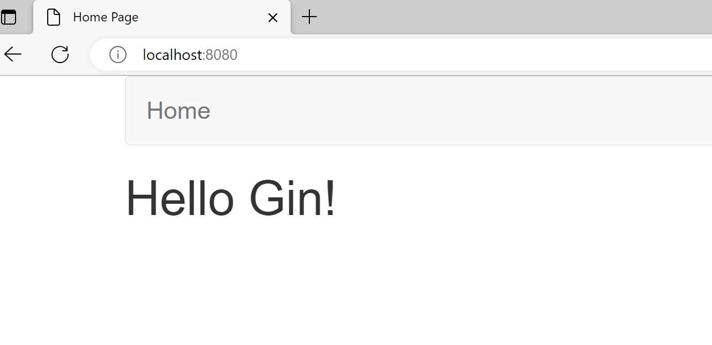
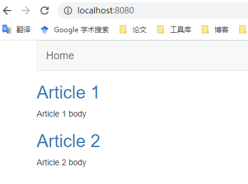
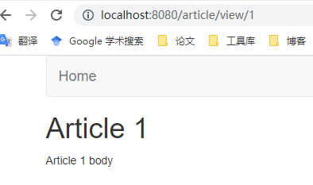
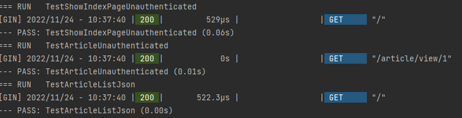

# 微服务构建教程-代码部分

# 1 初始化项目

> **创建自己的Github目录，并在自己的项目文件夹中初始化gomodule**
> 

我的文件夹为/data/user/golang/src/github.com/Yuxin1999/go-gin-app-chinese

代码为

```bash
mkdir /data/user/golang/src/github.com/Yuxin1999/go-gin-app-chinese
cd /data/user/golang/src/github.com/Yuxin1999/go-gin-app-chinese
go mod init
```

应用构建只需要使用一个外部依赖：Gin框架

安装Gin框架

```bash
go get -u github.com/gin-gonic/gin
```

# 2 创建可复用模板

我们的应用程序将使用模板显示一个网页。会有几个部分，如标题、菜单、侧边栏和页脚，在所有页面中都是通用的。Go允许我们创建可复用的模板片段，可以在其他模板中导入。

页眉和页脚将是所有模板中重复使用的共同部分。我们还将在自己的模板文件中创建菜单，它将被页眉模板使用。最后，我们将为索引页创建模板，它将导入页眉和页脚。所有的模板文件将被放置在项目目录下的`templates`目录中。

## 2.1 创建菜单模板

位置：`templates/menu.html`

代码为：

```html
<!--menu.html-->

<nav class="navbar navbar-default">
  <div class="container">
    <div class="navbar-header">
      <a class="navbar-brand" href="/">
        Home
      </a>
    </div>
  </div>
</nav>
```

此时的menu只有到Home page的链接，在之后的构建中我们会继续向menu中添加信息

## 2.2 创建页眉与页脚模板

位置：`templates/header.html`

代码为：

```html
<!--header.html-->

<!doctype html>
<html>

  <head>
    <!--Use the title variable to set the title of the page-->
    <title>{{ .title }}</title>
    <meta name="viewport" content="width=device-width, initial-scale=1">
    <meta charset="UTF-8">

    <!--Use bootstrap to make the application look nice-->
    <link rel="stylesheet" href="https://maxcdn.bootstrapcdn.com/bootstrap/3.3.6/css/bootstrap.min.css" integrity="sha384-1q8mTJOASx8j1Au+a5WDVnPi2lkFfwwEAa8hDDdjZlpLegxhjVME1fgjWPGmkzs7" crossorigin="anonymous">
    <script async src="https://maxcdn.bootstrapcdn.com/bootstrap/3.3.6/js/bootstrap.min.js" integrity="sha384-0mSbJDEHialfmuBBQP6A4Qrprq5OVfW37PRR3j5ELqxss1yVqOtnepnHVP9aJ7xS" crossorigin="anonymous"></script>
  </head>

  <body class="container">
    <!--Embed the menu.html template at this location-->
    {{ template "menu.html" . }
```

位置：`templates/footer.html`

代码为：

```html
<!--footer.html-->

  </body>

</html>
```

这里使用了开源的bookstrap框架

这个文件大部分是标准的html语言，然而有两行值得注意

- `<title>{{ .title }}</title>` 中的.title变量用于动态设置页面的标题
- `{{ template "menu.html" . }` 用来从menu.html中导入菜单模板

## 2.3 创建索引模板

索引模板引用了页眉页脚模板，并显示了一段简单的”Hello Gin”文字

位置：`templates/index.html`

代码为：

```html
<!--index.html-->

<!--Embed the header.html template at this location-->
{{ template "header.html" .}}

  <h1>Hello Gin!</h1>

<!--Embed the footer.html template at this location-->
{{ template "footer.html" .}}
```

其他页面的模板也会如索引模板一般引用页眉和页脚模板

# 3 创建入口函数

创建完模板之后，我们再来为应用创建一个入口文件

我们为最简单的web应用创建入口`main.go`文件，在其中使用索引模板

我们将使用Gin框架完成以下四个步骤：

## 3.1 创建路由

使用Gin创建默认路由的方式如下：

```go
router := gin.Default()
```

这创建了一个定义应用建立的路由

## 3.2 加载模板

一旦创建了路由，可以如下所示加载所有的模板；一旦加载，在之后的请求也不用再次读取这些文件

```go
router.LoadHTMLGlob("templates/*")
```

## 3.3 定义路由处理程序

Gin的核心是如何将应用程序划分为各种路由，并为每个路由定义处理程序。

我们将为索引页的路由创建一个内嵌的路由处理程序

```go
router.GET("/", func(c *gin.Context) {

  // Call the HTML method of the Context to render a template
  c.HTML(
      // Set the HTTP status to 200 (OK)
      http.StatusOK,
      // Use the index.html template
      "index.html",
      // Pass the data that the page uses (in this case, 'title')
      gin.H{
          "title": "Home Page",
      },
  )

})
```

router.GET函数为GET 请求定义路由处理方式，其参数为路由 `/` 与路由处理程序`func(c *gin.Context)`）

路由处理程序`func(c *gin.Context)`的参数为指向gin框架中`context`类的指针，`context`中包含了处理程序可能需要的关于此次请求的星系，如头文件、cookies等

Context也有用于渲染HTML、文本、JSON和XML格式的方法。在本例中，我们使用context.HTML方法来渲染一个HTML模板（index.html）。

在这个方法中我们还传递了额外的参数`title`，其值被设定为”`“Home Page”`。即页眉模板中的动态参数`title`也被设置为`“Home Page”`

## 3.4 启动应用

启动应用，使用router的run方法

```go
router.Run()
```

> 最终的`main.go`函数如下所示
> 
> 
> ```go
> package main
> 
> import (
> 	"github.com/gin-gonic/gin"
> 	"net/http"
> )
> 
> // 声明router为指向gin.Engine的指针类型
> var router *gin.Engine
> 
> func main()  {
> 	// 创建默认路由，给router赋值
> 	router := gin.Default()
> 
> 	// 加载所有的模板
> 	router.LoadHTMLGlob("templates/*")
> 
> 	// 给索引页定义路由处理程序,相应get请求
> 	// 参数为路由"/" 与处理上下文的函数
> 	router.GET("/", func(c *gin.Context) {
> 		// 使用context的html方法来渲染html文件
> 		c.HTML(
> 			// 设置http的状态为OK
> 			http.StatusOK,
> 			// 使用索引页模板
> 			"index.html",
> 			// 传递页面所需要的参数
> 			gin.H{"title":"Home Page"},
> 			)
> 	})
> 	// 启动路由
> 	router.Run()
> }
> ```
> 

在应用目录下执行如下命令

```go
go build -o app
```

这一命令将编译你的应用程序并创建一个可执行文件，你可以运行如下

```go
./app
```

（笔者在goland上运行，自动编译允许可执行文件）

然后在浏览器上访问本地8080接口，可以看到如下画面：



# 4 显示文章列表

## 4.1 重构入口文件

在这一部分，我们将添加在索引页上显示所有文章列表的功能。

由于我们将在索引页上显示文章列表，而索引页的处理路由已经定义，因此我们不需要额外的路由。

重构我们的main.go文件，如下

```go
package main

import (
	"github.com/gin-gonic/gin"
)

// 声明router为指向gin.Engine的指针类型
var router *gin.Engine

func main()  {
	// 创建默认路由，给router赋值
	router := gin.Default()

	// 加载所有的模板
	router.LoadHTMLGlob("templates/*")

	// 索引处理程序
	router.GET("/", showIndexPage )
	// 启动路由
	router.Run()
}
```

## 4.2 设计article模型

`article`结构体可以被设计如下，仅包含ID、标题和内容三个参数

```go
type article struct {
  ID      int    `json:"id"`
  Title   string `json:"title"`
  Content string `json:"content"`
}
```

绝大部分应用程序会使用数据库来保存数据，本项目中为简便将数据保存在内存中，并使用直接赋值

的`article`来初始化文章列表

```go
var articleList = []article{
  article{ID: 1, Title: "Article 1", Content: "Article 1 body"},
  article{ID: 2, Title: "Article 2", Content: "Article 2 body"},
}
```

我们把这些代码放在`model.article.go`的文件中，并用一个`getAllArticles()`函数来返回所有问政的列表，我们还将为它写一个测试，这个测试将被命名为`TestGetAllArticles`，保存在`models.article_test.go`文件中

> 综上，`models.article.go`的代码为
> 
> 
> ```go
> package main
> 
> type article struct {
> 	ID int `json:"id"`
> 	Title string `json:"title"`
> 	Content string `json:"content"`
> }
> 
> // 使用直接赋值初始化文章列表
> var articleList = []article{
> 	{ID: 1, Title: "Article 1", Content: "Article 1 body"},
> 	{ID: 2, Title: "Article 2", Content: "Article 2 body"},
> }
> 
> // 创建返回所有文章列表的函数
> func getAllArticles() []article{
> 	return articleList
> }
> ```
> 
> `models.article_test.go`的代码为
> 
> ```go
> package main
> 
> import "testing"
> 
> // 测试函数，测试能否获取所有的文章
> func TestGetAllArticles(t *testing.T) {
> 	alist := getAllArticles()
> 
> 	// 检查获取的列表长度是否和原始列表长度相同
> 	if len(alist) != len(articleList){
> 		t.Fail()
> }
> 	// 检查里面的对象是否都完全相同
> 	for i, v := range alist{
> 		if v.Content != articleList[i].Content ||
> 			v.ID != articleList[i].ID ||
> 			v.Title != articleList[i].Title{
> 			t.Fail()
> 			break
> 		}
> 	}
> }
> ```
> 

## 4.3 创建视图模板

由于文章列表将显示在索引页上，我们不需要创建一个新的模板。然而，我们需要改变index.html模板的内容，用文章列表替换当前内容。

我们假设文章列表将以`payload`的变量名被传递给模板，下面的代码片段将用来显示文章列表

```go
{{range .payload }}
    <!--Create the link for the article based on its ID-->
    <a href="/article/view/{{.ID}}">
      <!--Display the title of the article -->
      <h2>{{.Title}}</h2>
    </a>
    <!--Display the content of the article-->
    <p>{{.Content}}</p>
  {{end}}
```

这个片段将展示`payload`变量中的所有项目，并显示每篇文章的标题和内容。上述代码段还将链接到每篇文章。然而，由于我们还没有定义显示单篇文章的路由处理程序，这些链接还未生效。

更新后的index.html文件如下：

```go
<!--index.html-->

<!--Embed the header.html template at this location-->
{{ template "header.html" .}}

  <!--Loop over the payload variable, which is the list of articles-->
  {{range .payload }}
    <!--Create the link for the article based on its ID-->
    <a href="/article/view/{{.ID}}">
      <!--Display the title of the article -->
      <h2>{{.Title}}</h2>
    </a>
    <!--Display the content of the article-->
    <p>{{.Content}}</p>
  {{end}}

<!--Embed the footer.html template at this location-->
{{ template "footer.html" .}}
```

## 4.4 创建路由处理函数

我们将在`handlers.article.go`文件中为所有的文章功能创建路由处理程序

索引页的处理程序showIndexPage主要有以下几个功能

1. 获取文章列表: 在`models.article.go`中已经定义

```go
articles := getAllArticles()
```

1. 将文章参数传递给index.html并渲染，使用gin.context.html方法渲染

因此，handlers.article.go的代码如下

```go
package main

import (
	"net/http"

	"github.com/gin-gonic/gin"
)

func showIndexPage(c *gin.Context){
	articles := getAllArticles()

	// 渲染html，额外参数为title和payload
	c.HTML(
		http.StatusOK,
		"index.html",
		gin.H{
			"title": "Home Page",
			"payload": articles,
		},
		)
}
```

此时运行main函数，访问Localhost:8080端口，出现以下界面



# 5 显示单篇文章

在上一部分我们显示了文章的索引，但是单篇文章的链接未生效，这里我们将为显示单篇文章添加路由处理器和模板

## 5.1 设置路由，更新主函数

我们可以设置一个新路由，以与前一个路由相同的方式处理单个文章的请求。我们要给路由传入不同的文章url，Gin允许我们通过定义如下的路由参数来处理这种情况:

```go
router.GET("/article/view/:article_id", getArticle)
```

这个路由将匹配所有上述路径的请求，路由参数为article_id，使用getArticle处理这一路由

此时更新主函数如下：

```go
func main()  {
	// 创建默认路由，给router赋值
	router := gin.Default()

	// 加载所有的模板
	router.LoadHTMLGlob("templates/*")

	// 索引处理程序
	router.GET("/", showIndexPage)
	// 单篇文章处理程序
	router.GET("/article/view/:article_id",getArticle)
	// 启动路由
	router.Run()
}
```

## 5.2 创建视图模板

我们为单篇文章的显示创建模板，它与Index模板的方式相同，唯一不同的是payload参数中只包含了一篇文章

templates/article.html 如下

```go
<!--article.html-->

<!--Embed the header.html template at this location-->
{{ template "header.html" .}}

<!--Display the title of the article-->
<h1>{{.payload.Title}}</h1>

<!--Display the content of the article-->
<p>{{.payload.Content}}</p>

<!--Embed the footer.html template at this location-->
{{ template "footer.html" .}}
```

## 5.3 创建路由处理程序

`getArticle`程序需要完成以下几个任务：

1. 提取要显示文章的ID：为了获取并显示正确的文章，我们首先需要从提取文章的ID。

```go
c.Param("article_id")
```

c 即`gin.Context`

1. 获取文章，使用`getArticleById()`函数获取，这一函数储存在`models.article.go`中，这一函数可以实现如下

```go
func getArticleByID(id int) (*article, error) {
  for _, a := range articleList {
    if a.ID == id {
      return &a, nil
    }
  }
  return nil, errors.New("Article not found")
}
```

1. 渲染`article.html`，并将文章传递给模板

依然使用context.HTML方法渲染，获取的article参数作为payload的值传入

在`handles.article.go`中添加`getArticle`函数如下：

```go
func getArticle(c *gin.Context){
	// 检查文章id是否有效
	if articleID, err := strconv.Atoi(c.Param("article_ID")); err == nil{
		// 检查是否获取了文章
		if article, err := getArticleByID(articleID); err == nil{
			// 若获取了文章，则渲染
			c.HTML(
				http.StatusOK,
				"article.html",
				gin.H{
					"title": article.Title,
					"payload": article,
				},
				)
		} else {
			// 若未找到该文章，返回该错误
			c.AbortWithError(http.StatusNotFound, err)
		}
	}else {
		// 若文章ID无效，返回该错误
		c.AbortWithStatus(http.StatusNotFound)
	}
}
```

此时再访问8080端口，可以点开文章链接



# 6 响应JSON/XML

## 6.1 创建通用渲染函数

之前的部分，我们一直使用Gin的Context的HTML方法，在路由处理程序中直接渲染，但实际过程中，我们可能需要根据请求来改变响应的格式，重构一个负责渲染的单一函数。

因此，我们在`main.go`中创建一个`render`函数，它将根据`Accept Header`渲染不同的格式。

在Gin中，传递给路由处理程序的`Context`包含一个名为`Request`的字段。这个字段中的`Header`字包含所有的请求头。我们可以使用Header的Get方法来提取`Accept Header`，如下所示

```go
// c is the Gin Context
c.Request.Header.Get("Accept")
```

当`Accept Header`被设置为JSON/XML/HTML时，render函数会进行响应格式的渲染

渲染函数的代码如下：

```go
// 根据Accept header渲染不同的格式
func render(c *gin.Context, data gin.H, templateName string){
	switch c.Request.Header.Get("Accept") {
	case "application/json":
		// 渲染json格式
		c.JSON(http.StatusOK, data["payload"])
	case "application/xml":
		// 渲染xml格式
		c.XML(http.StatusOK, data["payload"])
	default:
		c.HTML(http.StatusOK, templateName, data)
	}
}
```

## 6.2 更新路由处理程序

将之前的路由处理程序中的c.HTML方法替换为Render方法即可

`showIndexPage`替换为如下：

```go
func showIndexPage(c *gin.Context){
	articles := getAllArticles()

	// 根据格式渲染
	render(c, gin.H{
			"title": "Home Page",
			"payload": articles,}, "index.html")
}
```

使用如下方法测试新功能

```go
curl -X GET -H "Accept: application/json" http://localhost:8080/
```

我们把接受头设置成为了json格式，因此得到了一个json格式的响应

# 7 编写测试文件与测试

## 7.1 通用测试文件（通用辅助函数）

为了实现测试，我们编写了一些通用的辅助函数：

- TestMain函数设置Gin使用测试模式，并调用其余的测试函数。
- getRouter函数以类似于主程序的方式创建并返回一个路由。
- saveLists()函数将原始文章列表保存在一个临时变量中。
- 这个临时变量被restoreLists()函数用来在执行单元测试后将文章列表恢复到其初始状态。
- 最后，testHTTPResponse函数执行传入的函数，看它是否返回一个布尔真值--表示测试成功，或不成功。这个函数帮助我们避免重复测试HTTP请求的响应所需的代码。

这些代码储存在`common_test.go`，其代码如下

```go
package main

import (
	"net/http"
	"net/http/httptest"
	"os"
	"testing"

	"github.com/gin-gonic/gin"
)

// 声明用于储存的临时列表
var tmpArticleList []article

// 在执行测试功能之前，先进行一些设置
func TestMain(m *testing.M){
	// 将gin设置为Test模式
	gin.SetMode(gin.TestMode)
	// 执行其他的测试
	os.Exit(m.Run())
}

// 用于在测试期间创建路由
// 此处创建的路由为该项目标准路由
func getRouter(withTemplates bool) *gin.Engine{
	r := gin.Default()
	if withTemplates {
		r.LoadHTMLGlob("templates/*")
	}
	return r
}

// 执行request并测试其reponse
func testHTTPResponse(t *testing.T, r *gin.Engine, req *http.Request,
	f func(w *httptest.ResponseRecorder) bool) {

	// 创建一个记录reponse的recorder
	w := httptest.NewRecorder()

	// 使用输入的路由，执行输入的request，并使用刚刚创建的recorder记录
	r.ServeHTTP(w, req)

	// 将该响应输入布尔函数，判断是否符合布尔函数规则
	if !f(w) {
		t.Fail()
	}
}

// 将一次测试的数据储存在临时列表中
func saveLists() {
	tmpArticleList = articleList
}

// 从临时列表中恢复主列表
func restoreLists() {
	articleList = tmpArticleList
}
```

## 7.2 索引页测试文件

为索引界面编写单元测试，在索引页的显示中，我们需要检查以下两个情况：

- 处理程序是否返回了HTTP状态码200
- 返回的HTML的标题是否为”Home Page”

测试的代码将被放在`handlers.article_test.go`文件中的`TestShowIndexPageUnauthenticated`函数中。

为了检查HTTP的状态码和返回的HTML文件，我们需要做以下四步：

1. 创建一个新路由
2. 将该路由的处理程序定义为主程序所使用的处理程序（在本例中，是showIndexPage）
3. 创建一个新的请求来获取这个路由
4. 定义检查http测试结果的规则
5. 将路由、请求与规则函数传入testHTTPResponse来完成一次测试

`handlers.article_test.go`的内容如下

```go
package main

import (
	"io/ioutil"
	"net/http"
	"net/http/httptest"
	"strings"
	"testing"
)

// 测试对home page的get请求
// 对未认证用户返回http状态码200
func TestShowIndexPageUnauthenticated(t *testing.T){
	// 1. 创建一个新路由
	r := getRouter(true)
	// 2. 将该路由的处理程序定义为主程序所使用的处理程序
	r.GET("/", showIndexPage)

	// 3. 创建一个request获取路由(method为get，路由为/）
	req, _ := http.NewRequest("GET", "/", nil)

	// 调用common_test.go中的testHTTPResponse函数
	// 参数为创建的路由， 创建的request与判断状态的bool函数
	// 调用时定义该布尔函数，判断响应是否符合当前一次定义的规则
	testHTTPResponse(t, r, req, func(w *httptest.ResponseRecorder) bool {
		// 测试http状态码是否为200
		statusOK := w.Code == http.StatusOK

		// 测试页面标题是否为主页
		p, err := ioutil.ReadAll(w.Body)
		pageOK := err == nil && strings.Index(string(p), "<title>Home Page</title>") > 0

		return statusOK && pageOK
	})
}}
```

## 7.3 编写文章显示页测试文件

在这一路由处理程序中，我们需要检查以下两种情况

- 处理程序的HTTP响应状态码是否为200
- 返回的HTML是否包含一个标题标签，其中包含被获取的文章的标题。

测试的代码将被放在`handlers.article_test.go`文件中的`TestArticleUnauthenticated`函数中。

```go
func TestArticleUnauthenticated(t *testing.T){
	// 获取一个默认路由
	r := getRouter(true)

	r.GET("/article/view/:article_id", getArticle)

	// 创建一个request获取路由(method为get，路由为/article/view/1）
	req, _ := http.NewRequest("GET", "/article/view/1", nil)

	// 调用common_test.go中的testHTTPResponse函数
	testHTTPResponse(t, r, req, func(w *httptest.ResponseRecorder) bool {
		// 测试http状态码是否为200
		statusOK := w.Code == http.StatusOK

		// 测试页面标题是否为文章标题
		p, err := ioutil.ReadAll(w.Body)
		pageOK := err == nil && strings.Index(string(p), "<title>Article 1</title>") > 0

		return statusOK && pageOK
	})
}
```

## 7.4 编写XML与JSON响应测试文件

这里我们主要检查以下两种情况：

- 当Accept头被设置为application/json时，应用程序返回JSON格式的文章列表
- 当接受头设置为application/xml时，测试应用程序返回XML格式的文章

这些将被添加为名为`TestArticleListJSON`和`TestArticleXML`的函数。

```go
// 测试accept head为application/json时，应用程序返回JSON格式的文章列表
func TestArticleListJson(t *testing.T){
	// 获取一个默认路由
	r := getRouter(true)

	r.GET("/", showIndexPage)

	// 创建一个request获取路由(method为get，路由为/）
	req, _ := http.NewRequest("GET", "/", nil)
	// request头中添加格式字段
	req.Header.Add("Accept", "application/json")

	// 调用common_test.go中的testHTTPResponse函数
	testHTTPResponse(t, r, req, func(w *httptest.ResponseRecorder) bool {
		// 测试http状态码是否为200
		statusOK := w.Code == http.StatusOK

		// 测试响应是否为json格式
		p, err := ioutil.ReadAll(w.Body)
		if err != nil{
			return false
		}
		var articles []article
		// 将响应内容p储存在articles中
		err = json.Unmarshal(p, &articles)
		// json格式&&文章列表长度>2&&状态正确
		return err == nil && len(articles) >=2 && statusOK
	})
}

// 测试accept head为application/xml时，应用程序返回xml格式的文章
func TestArticleXML(t *testing.T){
	// 获取一个默认路由
	r := getRouter(true)

	r.GET("/article/view/:article_id", getArticle)

	// 创建一个request获取路由(method为get，路由为/）
	req, _ := http.NewRequest("GET", "/article/view/1", nil)
	// request头中添加格式字段
	req.Header.Add("Accept", "application/xml")

	// 调用common_test.go中的testHTTPResponse函数
	testHTTPResponse(t, r, req, func(w *httptest.ResponseRecorder) bool {
		// 测试http状态码是否为200
		statusOK := w.Code == http.StatusOK

		// 测试响应是否为json格式
		p, err := ioutil.ReadAll(w.Body)
		if err != nil{
			return false
		}
		var a article
		// 将响应内容p储存在article中
		err = xml.Unmarshal(p, &a)
		// xml格式&&文章ID与标题正确&&状态正确
		return err == nil && a.ID == 1 && len(a.Title) >=0 && statusOK
	})
}
```

## 7.5 测试

最后运行我们的测试，在项目目录下，执行以下命令

```go
go test -v
```

可以获得以下结果

